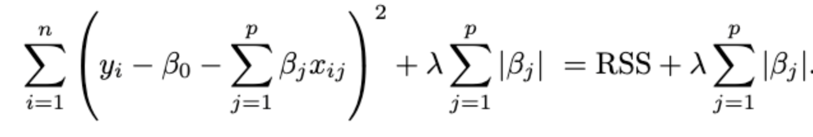
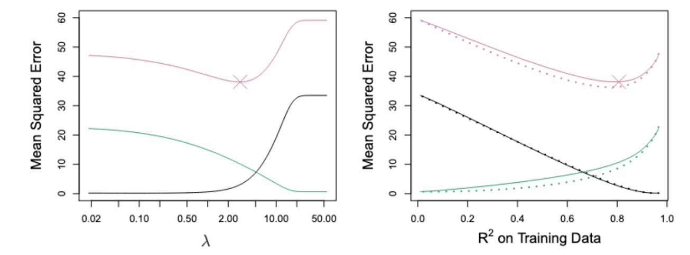

2025년 8월 5일 스터디 기록

## 왜 우린 선형 모델을 사용할까?

-> _단순함, 수학적으로 쉽고 해석 쉽다._
선형 모델은 비선형 모델에 비해 이점이 있다. (해석 가능성, 추론, 실제 현실 문제 등)

$$
Y=β0​+β1​X1​+⋯+βp​Xp​+ϵ
$$

반응 변수 Y, 예측 변수 X 사이의 관계를 나타낸다. ->최소 제곱법
최소 제곱법(Least Squares)을 사용하여 데이터를 '적합(fit)'시킵니다
비선형 방법론과 비교했을 때 놀랍도록 경쟁력 있는 결과를 보여주기도?

따라서 비선형 세계로 이동하기 전에, 이 장에서는 일반 최소제곱 피팅(plain least squares fitting)을 몇 가지 대체 피팅 절차로 대체하여 *간단한 선형 모델*을 개선할 수 있는 몇 가지 방법에 대해 설명합니다. (리지 회귀와 라쏘 회귀)

## 최소제곱법(least squares)의 한계

_최소제곱법이란?_
관측된 실제 값과 모델이 예측하는 값 사이의 차이(RSS)를 최소화하는 것입니다.
이 오차를 최소화하는 방향으로 파라미터를 추정한다.

$$
mini=1∑n​(Yi​−Y^i​)2
$$

### 1. Prediction Accuracy

n이 p보다 훨씬 크지 않으면, 최소제곱법은 큰 분산을 갖는 경향이 있다.
(n은 샘플 수, p는 예측 변수 수)
분산이 크다는 것은 넓게 흩어져있다는 걸 의미. 매우 low bias를 가진다.
훈련 데이터셋이 조금만 달라져도 계수 추정치들이 크게 달라질 수 있다는 의미다.
결국 높은 분산 때문에 테스트 셋에 대한 예측 성능은 낮은 경향이 있다.
한마디로 과적합 될 가능성이 있다!

### 2. Model Interpretability

모델 해석 가능성이란?

> 어떤 요인이 영향을 미치는지 알기 쉬운 정도
> Y에 어떤 X가 가장 큰 영향을 미치는지를 쉽게 알려면? -> 모델이 단순해야 함!

다중 회귀 모델에 사용된 변수 중 일부 또는 다수가 실제로는 응답과 관련이 없는 경우가 종종 있습니다.
상관이 없는 변수들 -> 모델 불필요한 복잡성 유발!
해당 계수 추정치를 0으로 설정하면 model interpretability가 좋은 모델을 얻을 수 있습니다.

> n이 p보다 훨씬 크지 않을 때 최소제곱법의 분산이 높아지는 문제를 해결하기 위해 Rasso, Ridge회귀가 등장했다.

## 3가지 변수 선택 기법

#### Subset Selection

Y와 관련있다고 생각하는 x인 p예측 집합을 식별하는 것.
과적합 방지 목적.

#### Shrinkage

모든 p 예측변수를 모델에 포함시키되, 각 중요도를 조절하여 영향력을 조정하는 방식
예측된 계수는 0으로 shrunken된다.
이 shrinkage는 분산을 줄이는 데 효과적이다.

#### Dimension Reduction

예측변수들을 더 적게 압축하거나 변환하는 것.
p개의 예측 변수를 M차원 부분 공간으로 투영하는 것.
M개의 다른 linear combinations, or projections을 계산한다.
M projections은 최소제곱법에 의해 선형 회귀 모델에 fit하기 위해 예측자로써 사용됨.
ex. 주성분 분석

## 6.1 Subset Selection

best subset selection(최적의 부분 집합 선택)을 위해 우린 최소 제곱법 회귀를 분리한다.
p 예측변수의 조합를 위해서 p 모델을 fit하는 것이다.

> best model를 선택하는 문제는 그리 간단하지 않는다.
> 여러 단계로 나눠 best를 식별하는 것이 목표!

과정 차근차근 알아보기

1. Null model (M0) 설정하기: predictors 포함 x. 각 관측치에 대한 sample mean를 예측한다.
    1. k 개의 predictors를 포함하는 모델을 fit한다.
    2. 최고 모델: 1부터 p중에서, 가장 작은 잔차 제곱합 RSS를 선택하여 이것을 Mk라고 부른다.
2. 마지막으로 M0 ~ Mp까지의 모델 중, 테스트 오차를 최소화하는 하나의 최적 모델을 선택한다.

#### Q1. 왜 validation set에서의 오차를 사용하여 best model을 찾을까? (난이도: 하)

답: 검증 세트는 모델 훈련에 사용되지 않은 데이터셋이니까. 일반화 성능을 나타낼 수 있다.

#### Q2. RSS를 이용해서 best model을 찾는건 왜 어려울까? (난이도: 중)

답: 잔차 제곱 합은 변수의 수가 증가하면 단조감소한다.
RSS만으로 모델을 선택하면 안된다. 훈련 오차를 나타내기 때문이다.
훈련 오차는 테스트 오차보다 상당히 작은 경향이 있다.

Predictor가 늘어날수록 RSS는 계속 감소한다.
오른쪽은 결정 계수(R^2)이 계속 늘어난다.

그러나 이것만으로는 best model을 선택할 수 없다.
Why? training set에서 overfitting 발생할 수 있기 때문에 test set에 대한 예측 성능을 보장할 순 없다.

### Stepwise Selection

best subset selection의 대안으로 사용
많은 수의 p 예측변수들을 가질 때, 모든 가능한 모델을 탐색하는 것이 아니라, 제한된 수만 탐색한다.
연산량 문제, 통계적 문제(과적합 위험)

1. null모델 M0에서 시작함. (M0란 예측 변수가 없는 가장 단순한 모델)
   연산량의 이유로 best subset selection는 매우 큰 p에 적용되기 어렵다.
2. 예측 변수(Mk)를 하나씩 추가한다.
   모델 적합도를 가장 크게 향상시키는(즉, RSS를 가장 크게 감소시키는) 변수 Mk+1을 선택한다.
3. validation set에서 에러를 이용해서 최적의 모델을 선택한다.

예측 변수들을 한 번에 하나씩 모델에 추가해 나간다.
M0에서 시작해서 income, student를 하나씩 추가하여 적합도를 평가한다.
3개까지는 그대로 동일하게 rating, income, student를 선택한다.
그러나 변수가 4개부터 결과가 달라진다.

> 단계적 forward stepwise가 연산 효율적이지만,
> best subset을 찾는 것을 보장하진 않는다.

#### Q3. Forward stepswise와 Best subset이 왜 달라졌을까? (난이도: 상)

왜 Best subset은 rating을 포함하지 않고, cards, income, student, limit으로 바뀌었을까?
이 새로운 조합(모델이 rating 을 card로 대체하는 것)이 더 좋은 조합이라고 판단했기 때문이다.
더 최적이라고 판단.

### Backward Stepwise Selection

forward방식처럼, best subset selection을 대체하는 효율적인 대안이다.
foward와 반대 방향으로 모델을 탐색한다. 모든 예측 변수가 포함된 모델에서 시작하여, 중요도가 낮은 변수를 하나씩 제거한다.

#### forward방식보다 무엇이 더 좋을까?

null model에서 시작하는 forward와는 다르게, full model인 모든 예측 변수를 포함하는 모델에서 시작한다.
-> foward는 다른 변수와의 상호작용을 통해 중요한 역할을 하는 경우, 해당 변수가 초기에 선택되지 않아 모델에서 완전히 제외될 수 있습니다.
초기 모델에 중요한 변수가 포함되어있기 때문에 더 잘 반영된다.
p가 비교적 작을 때 더 잘 작동하는 경향이 있다.

### Choosing the Optimal Model

test error를 이용해서 best model을 선택하려며?
우린 모델 선택 시 훈련 오차 지표(RSS, R²)의 함정을 경계하고 test error를 예측해야 한다.
RSS, R^2의 한계는 훈련 오차와 관련되어있기 때문에, best model을 선택하는 데에는 불충분하다.

> 우리의 목표: 낮은 _test error_ 얻는 것

1. train error를 보정하여 간접적으로 test error를 예측한다. -> Vp, AIC, adjusted R^2, BIC
2. validation set 또는 cross-validation을 이용해서 직접적으로 test error를 예측한다.

#### 1. Cp 통계량

모델의 예측 성능을 평가하는 통계량
모델에 포함된 변수의 개수가 다를 때 모델을 선택할 때 사용되는 통계량.
훈련 세트 MSE는 test MSE에 일반적으로 underestimate이다.
훈련 세트 RSS나 훈련 세트 R2는 변수 개수가 다른 모델 중에서 선택하는 데 사용될 수 없습니다

RSS만으로는 모델의 예측을 제대로 평가하기 어렵다ㅠㅠ
2dσ^2 를 추가함으로써, 변수를 많이 추가할수록, Cp값이 커진다.
(Cp가 최소가 되는 best model을 찾는 것)
Cp 통계량은 훈련 RSS에 `2dσˆ2`의 **페널티**를 추가하여 훈련 오류가 테스트 오류를 과소평가하는 경향을 조정합니다.

d: 모델의 예측 변수
sigma: 오차 분산의 추정치

$$
Cp = 1 /n  (RSS + 2dσˆ2),
$$

#### 2. AIC criterion

최대 우도에 의해 적합한 광범위한 모델에 정의됨.
가우시안 오차(Gaussian errors)를 갖는 선형 모델의 경우, 최대 우도와 최소 제곱법은 동일하며, AIC는 다음과 같습니다

$$
AIC = 1  n  (RSS + 2dσˆ2) ,
$$

#### Q4. Cp와 AIC 둘다 (1/n) \* (RSS + 2dσˆ2) 식인데 무슨 차이일까?

Cp:
MSE, 즉 예측 오류를 최소화하는 것이 목표다. 선형 회귀에 특화되어있다.
선형 회귀의 예측 오류 최소화에 초점을 맞춘다
AIC:
최대 우도로 적합시킨 광범위한 모델 클래스에 대해 정의되는 기준.
선형 회귀뿐만 아니라 로지스틱 회귀 등 **다양한 종류의 통계 모델**에 범용적으로 적용될 수 있는 **더 일반적인 모델 선택 기준**

최대우도: 관측된 데이터가 가장 '그럴듯하게' 나타나도록 모델을 만드는 방식

최소 제곱법으로 적합된 선형 모델의 경우? -> Cp와 AIC는 서로 비례하고 동일하다.

#### 3. BIC

Cp와 마찬가지로 테스트 오류가 낮은 모델에서 작은 값을 가진다.
Cp와 패널티 항이 다르다. -> log n를 추가하여 Cp보다 더 많은 모델에 더 *무거운 패널티*를 부여한다.

#### 4. Adjusted R2

R^2는 모델이 종속 변수(Y)의 총 변동량 중에서 얼마나 많은 부분을 설명하는지를 나타내는 지표입니다.
R2가 높을수록 모델이 데이터를 잘 설명한다고 봅니다.

> R^2의 문제: 예측 변수(독립 변수)를 아무리 많이 추가하더라도 R^2은 항상 증가한다.
> 불필요한 변수가 많이 들어간 모델을 best model이라고 잘못 판단할 수 있다. (복잡도 문제)
> 그래서 패널티를 준다.

RSS: 잔차제곱합, 오차의 합계
TSS: 총 제곱합, 종속 변수(Y)의 총 변동량
n은 데이터 포인트의 수
d: 모델에 포함된 예측 변수의 개수
모델이 잘 설명하지 못하는 평균 오차(RSS) / TSS

_RSS/(n−d−1) 부분 설명_
d가 포함되어있다. 예측 변수가 많아져도 분모에 d가 포함되어 있기 때문에,
노이즈 변수가 추가되어도, d가 같이 늘어나서 조정된다.
나머지 통계량과 달리, Adjusted R^2가 커질수록 모델이 좋은 것!!

Adjusted R^2 큰 값이 낮은 test error를 나타내고,
이론적으로 가장 큰 adjusted R^2을 가진 모델은 올바른 변수를 포함하고, 노이즈 변수는 포함하지 않는다.
R^2통계량과 달리, 불필요한 변수가 포함되는 것에 대해 'pays a price'를 한다.

> 좋은 모델을 선택하려면, 수정된 R^2 이 큰 모델을 선택하자.

_개수의 집중_
여기서 Cp와 BIC는 test MSE의 예측이다.
Cp는 6개의 변수를 추가했을 때, 가장 낮은 지점을 보인다. (강력한 패널티) -> 최적점
BIC는 4개일 때 가장 낮은 지점이다.(약간의 패널티) -> 최적점
Adjusted R2는 증가하다가 변수가 7개일 때 가장 높은 점을 가리킨다.

> 모델 선택 기준에 따라 최적의 모델 복잡성(변수의 수)이 달라질 수 있다.

## Shrinkage Methods

지금까지는 subset selection을 봤지만, 계수 축소(Coefficient Shrinkage) 또는 정규화(Regularization)를 비교해보자

### 1. Ridge Regression

최소제곱법은 RSS(잔차제곱합) 값을 최소화하는 값을 추정하여 회귀 계수를 찾는다.
RSS: 실제 값 y와 예측값의 차이를 제곱하여 더한 값

리지 회귀는 least squares과 유사하다.
계수 추정 하는 방식은 다르다.
tuning parameter: λ ≥ 0, 별도로 결정됨
Shrinkage Penalty: λ ∑ j βj2 (람다가 있는 시그마 항)

> Ridge regression은 이 페널티항을 최소화함으로써 *계수 추정치 Bj*를 0에 가깝게 수축시킨다.

계수 추정치란? : 집값 = (상수) + (집 크기) _ β1​ + (방 개수) _ β2​ + (역과의 거리) \* β3​ + 오차

### Why Does Ridge Regression Improve Over Least Squares?

Least Squares보다 ridge regression이 왜 성능이 향상되는가?

_bias-variance trade-off_ 때문이다.
람다가 증가하면, 릿지 회귀의 유연성이 감소한다. => 분산 감소, 편향 증가.

초록: variance
검정: Squared bias
점선: 가능한 최소 MSE
분홍: Test MSE -> 핵심 지표!

x축이 튜닝 파라미터 람다이고, y축이 MSE이다. Y값ㅇ ㅣ작을수록 성능이 좋다.
람다가 0일때, 분산이 높다. 편향이 낮다.
그러다 점점 람다가 커지면서 bias가 커지고 MSE는 줄어들다가 다시 증가.

MSE ≈ 분산+편향

> 람다가 증가하면 릿지 회귀의 유연성이 감소한다.
> 계수 추정치를 0에 가깝게 수축시키기 때문이다.
> 특정 람다에 가까울 때, Test MSE가 낮다

오른쪽 그래프는 릿지 회귀 예측 계수에 L2 norm을 적용하였다.

#### Q. 모델의 유연성이 감소하면 왜 안좋을까?

모델의 유연성이 감소되면 분산이 감소된다. = 노이즈에 덜 민감하다.
그러나 너무 수축하면 편향이 증가한다.
적절한 람다를 이용해서 전체 MSE가 급격히 줄어드는 지점을 찾아야 한다.

### 2. Lasso Regression

_릿지 회귀의 단점?_

-   릿지 회귀는 마지막 모델에서 모든 p개의 변수 예측자들을 포함한다. (모든 예측 변수 키, 몸무게 등, 모두 사용하려고 한다.)
-   penalty항인 λ ∑ βj2 는 전체 계수 추정치(coefficients)를 줄이지만, 정확히 0으로 만들진는 않는다. (쓸모 없는 변수들을 없애지 못한다.)
-   모델 해석이 어려움: 변수 p의 수가 꽤 많은 설정에서는 문제가 될 수 있다. (어떤 변수가 중요한 변수인지 알아내기 어렵다)

> 라쏘 회귀는 이러한 릿지 회귀의 단점을 극복한다!!!

#### Q. Ridge Regression과 무엇이 다를까? (난이도: 하)

릿지 회귀의 L2 패널티 대신, L1 패널티 항 λ∑∣βj​∣ 을 사용한다.

라쏘 회귀의 패널티 항은 무슨 역할을 할까?

-   L1 페널티는 튜닝 파라미터 λ가 충분히 클 때 일부 *계수 추정치*를 정확히 0으로 만드는 효과가 있다.
-   덕분에 불필요한 변수들의 계수를 0으로 만들고, 이를 통해 변수 선택과 모델 해석 가능성을 제공한다.
-   최적의 성능을 위해 λ 값을 잘 선택하는 것이 매우 중요하다!

### Lasso vs Ridge regression

패널티항의 형태에 따라 기하학적으로 표현
계수가 B1, B2 만 있다고 가정.
등고선 바깥으로 나갈수록 RSS가 더 커진다. -> 오차가 더 커진다.

빨간색 타원: RSS의 등고선
중심 점: 최소제곱법으로 추정한 계수 추정치
타원이 작아질수록, RSS가 감소한다.

> 우리의 목표는 이 RSS를 작게 만드는 것이다!

_왼쪽은 라쏘 회귀_
L1 페널티 항은 λ∑∣βj​∣=λ(∣β1​∣+∣β2​∣) -> 기하학적으로 중심이 0인 마름모 형태다.
s가 작아지거나 람다가 커지면 마름모는 작아진다.
마름모와 접촉하는 지점에서 계수가 0이 된다!
특정 계수 중 하나를 0으로 만들 가능성이 높다. = 쓸모 없는 변수를 0으로 만든다! = 변수 선택 효과

_오른쪽은 릿지 회귀_
L2 페널티 항은 (λ∑βj2​=λ(β12​+β22​)) -> 기하학적으로 중심이 0인 원이다.
빨간색 타원 RSS가 원에 접하는데, 0에 가깝게 계수들을 수축시키지만, 계수를 0으로 만들지는 않는다.
원에 접하면 최적의 계수 추정치를 갖는다.
두 계수 모두 0이 되는 경우가 발생하지 않는다.
접점 (B1, B2)는 모두 0이 아닌 값을 가진다. = 모든 변수가 모델에 포함된다.

#### figure 6.8 - 라쏘(Lasso) 회귀의 성능과 릿지(Ridge) 회귀와의 비교를 bias-variance trade-off관계

라쏘가 실선
릿지가 점선
black: 제곱 편향
초록: 분산
보라: test MSE

_람다에 따른 MSE_
람다가 증가하면? -> 분산은 감소, 편향은 증가 -> 라쏘와 리지가 동일함

_R^2에 따른 MSE_
R^2이 증가하면? -> 릿지가 MSE 예측 성능이 좋다.

#### Q. 왜 릿지가 더 예측 성능이 좋게 나왔을까?

릿지가 더 나은 성능을 보이는 이유는?
릿지 회귀는 모든 변수를 활용하려고 한다. 계수만 수축시킬 뿐, 계수를 0으로 만들지는 않음.
반면, 라쏘 회귀는 불필요한 변수의 계수를 0으로 만들기 때문에,
이 그래프처럼, 모든 변수가 의미있는 상황에서는 릿지 회귀가 더 성능이 좋다.

#### Q. 라쏘가 더 성능이 좋은 경우, 이유는?

라쏘의 제곱 편향이 더 작고, 분산은 더 낮다. -> 라쏘가 더 예측 성능이 좋다!

이 데이터는 45개의 예측 변수 중 단 2개만이 응답 변수와 관련되어 있다
즉, 불필요한 노이즈 변수가 많을 때, 라쏘가 MSE가 훨씬 작게 나온다.

### 어떤 상황에서 라쏘가 더 좋고, 어떤 상황에서 릿지가 더 좋은가?

_릿지가 더 좋을 때_: 응답 변수가 많은 예측 변수들과 관련되어 있을 때 (모든 변수가 다 중요할 때) -> 모든 변수를 활용하여 분산을 줄여준다.
_라쏘가 더 좋을 때_: 응답 변수와 관련된 몇 개의 예측 변수만 유의미한 계수를 가지고, 불필요한 변수가 많을 때.
-> 라쏘가 이런 변수들을 효율적으로 제거한다. 변수 선택을 하기 때문에 모델 해석이 더 쉽다

> 교차 검증(Cross-Validation)을 통해 데이터셋에서 어떤 접근 방식이 나을지 결정한다.

(교차검증: 데이터를 여러 부분으로 나누고, 훈련용 검증용으로 나눠 번갈아 사용하여 모델을 학습하고 평가함)

### Selecting the Tuning Parameter

ten-fold cross validation 결과

cross-validation을 통해 어떻게 Tuning parameter 람다를 선택할까?
람다가 커질수록 0에 수축한다.

_왼쪽: 교차 검증 오류 곡선_
점선이 있는 지점에서 람다가 최적의 해를 가진다. = 교차 검증 오류가 가장 작은 최적점이다.

_오른쪽: 라쏘 회귀 추정치_
그림에서 회색 선들은 관련 없는 노이즈 변수들이다.
라쏘 회귀를 이용해서 두 신호만 변수 모델에 포함하고, 나머지 회색 노이즈 변수들을 0으로 제거한다.

> 라쏘 + 교차 검증 조합 -> 노이즈 변수 효과적으로 제거 가능! -> 예측 정확도를 높인다!

The end.
